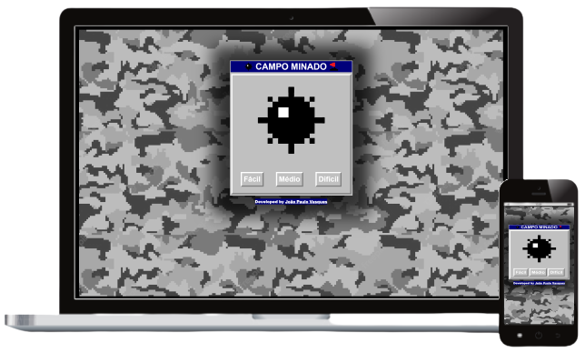

<h1 align="center">
Campo Minado / Minesweeper Game
</h1>

  

 

&nbsp;
 &nbsp;
 

 

# 📰 Description / Descrição

🇺🇸 - Classic Minesweeper game, where the objective is to mark the place where the bombs are located with the flags and reveal the unmarked spaces to check if the area is "safe". Developed in HTML, CSS and Javascript. It has a level selection menu (Easy - 15 Bombs), Medium (30 Bombs) and Hard (50 bombs), displays of the number of flags placed, total mines in the phase and a sign indicating victory/defeat. It also has buttons to restart the level or return to the selection menu.

 
🇧🇷 - Clássico Jogo de Campo Minado, onde o objetivo é demarcar com as bandeiras o local onde estão as bombas e ir revelando os espaços desmarcados para verificar se a área está "segura". Desenvolvido em HTML, CSS e Javascript. Conta com menu de seleção de nível (Fácil - 15 Bombas), Médio (30 Bombas) e Difícil (50 bombas), visores de quantidade de bandeiras colocadas, total de minas da fase e letreiro indicando vitória/derrota. Conta também com botões para reiniciar a fase ou voltar ao menu de seleçaõ.

 

# 🎮 Controls / Controles

🇺🇸
## 🖥️Computer:
- 🖱️Left Click to Reveal Field;
- 🖱️Right Click to Add/Remove Flag;

## 📱TouchScreen:
- 👇Pressionar para Revelar o Campo;
- 👇Pressionar e Segurar para Incluir/Remover a Bandeira;

🇧🇷  
## 🖥️Computador:
- 🖱️Clique Esquedo do Mouse para Revelar o campo;
- 🖱️Clique Direito do Mouse para Incluir/Remover a Bandeira;

## 📱TouchScreen:
- 👇Tap to Reveal Field;
- 👇Tap & Hold to Add/Remove Flag;

 

# 👷🔧 Built With / Construído Com

🇺🇸 - This project was built using these technologies: 
🇧🇷 - Este Projeto foi construído utilizando essas tecnologias:
- HTML5
- CSS3
- Javascript

 

# ✨ Features / Recursos
## 🇺🇸
- 🚥 Three dificulty levels (Easy, Medium and Hard);
- 📱 Fully Responsive;

## 🇧🇷
- 🚥 Três Níveis de Dificuldade (Fácil, Médio e Difícil);
- 📱 Totalmente Responsivo;

# 

